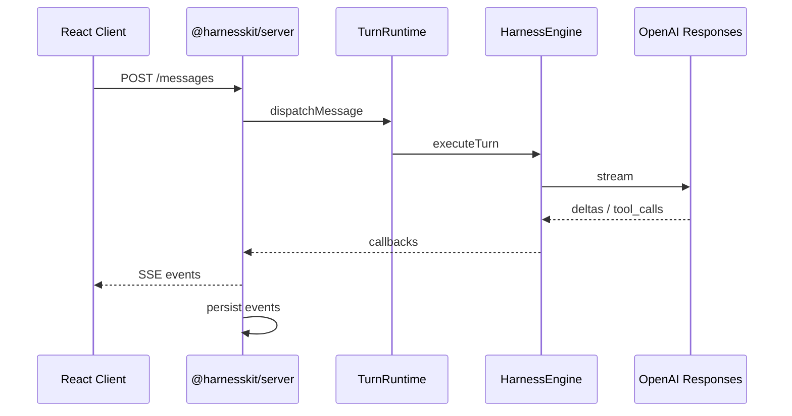

# HarnessKit 总体设计

> 版本：0.1.0 · 状态：Draft · 来源：SkillChat 提炼

## 1. 命名与定位

**HarnessKit**（`@harnesskit/*`）— AI Agent Harness 聊天工具包。

- **Harness**：强调 LLM Agent Loop（采样 → 工具 → 回填 → 继续）而非简单 Chat Completion
- **Kit**：模块化组合，可按需引入 protocol / core / harness / server / react
- **一行接入**：`createHarnessChatBootstrap()` + `<HarnessChat />` 即可跑通完整聊天链路

### 设计目标

| 目标 | 指标 |
|---|---|
| 接入成本 | 后端 ≤ 5 行、前端 ≤ 3 行完成 MVP |
| 协议稳定 | `@harnesskit/protocol`  semver 独立，Breaking 变更 major bump |
| 可扩展 | Tool、Skill、Persistence、Auth 均可插件替换 |
| 主题可配 | React 组件通过 CSS 变量 + preset 支持品牌配色（见 [THEMING.md](./THEMING.md)） |
| 框架无关 | Core/Harness 零框架依赖；Server 默认 Fastify；React 可选 |

### 非目标（留在应用层）

- 用户注册/登录、邀请码、Admin 面板
- Skill 市场安装与发布
- 具体业务 UI（Sidebar、Market 页等）

---

## 2. 分层架构

```
┌─────────────────────────────────────────────────────────────┐
│                     Consumer Application                     │
│  (SkillChat, 你的 SaaS, 内部工具...)                          │
└───────────────┬─────────────────────────────┬───────────────┘
                │                             │
    ┌───────────▼──────────┐      ┌───────────▼──────────┐
    │  @harnesskit/server  │      │  @harnesskit/react   │
    │  Fastify 路由 + DI   │      │  Hooks + UI 组件       │
    └───────────┬──────────┘      └───────────┬──────────┘
                │                             │
                └──────────────┬──────────────┘
                               │
                ┌──────────────▼──────────────┐
                │    @harnesskit/protocol     │
                │  类型 · Schema · SSE 常量    │
                └──────────────┬──────────────┘
                               │
         ┌─────────────────────┼─────────────────────┐
         │                     │                     │
┌────────▼────────┐  ┌─────────▼────────┐  ┌────────▼────────┐
│ @harnesskit/core│  │@harnesskit/harness│  │  Adapters       │
│ Turn Runtime    │  │ LLM Agent Loop   │  │  (File, Skill,  │
│ StreamHub       │  │ Tool Catalog     │  │   Script, Auth) │
└─────────────────┘  └──────────────────┘  └─────────────────┘
```

---

## 3. 核心概念

### 3.1 Turn（轮次）

一次用户意图到 assistant 最终回复的完整生命周期。支持：

- **Mid-turn Steering**：运行中追加用户输入
- **Follow-up Queue**：当前 turn 不可 steer 时排队
- **Interrupt**：用户主动中断
- **Phase 状态机**：sampling → tool_call → streaming_assistant → ...

### 3.2 StoredEvent（事件日志）

Append-only 消息事件模型（非简单 role/content 数组）：

- `TextMessageEvent`、`ToolCallEvent`、`ToolResultEvent`
- `ThinkingEvent`、`ImageMessageEvent`、`FileEvent`

### 3.3 SSE 实时通道

客户端 ↔ 服务端唯一实时协议（无 WebSocket）：

`text_delta` · `tool_start` · `turn_started` · `turn_completed` · `done` · ...

StreamHub **不缓冲**离线事件 — 重连后必须 REST 对账。

### 3.4 Harness（引擎）

对接 OpenAI Responses API 的多轮 Agent Loop：

- Instructions + History 构建
- Tool 注册与并行执行
- 上下文压缩（auto-compact / `/compact`）
- 图像生成等原生工具

---

## 4. 公共 API 设计

### 4.1 服务端 — `createHarnessChatBootstrap`（推荐）

大多数项目使用 Bootstrap 即可；已有完整 DI 时用底层 `createHarnessChat`。

```typescript
import { createHarnessChatBootstrap } from '@harnesskit/server';

const chat = createHarnessChatBootstrap({
  // 必需
  llm: {
    apiKey: string;
    baseUrl?: string;      // 默认 OpenAI
    model?: string;        // 默认 gpt-5.4
  },

  // 可选 — 均有合理默认
  dataRoot?: string;       // 默认 ./data
  tools?: ToolCatalogBuilder;
  skills?: SkillCatalogProvider;
  files?: FileContextProvider;
  scripts?: ScriptExecutor;
  auth?: AuthResolver;     // 解析 req → ChatUser
  persistence?: PersistenceBundle;  // 覆盖默认 JSONL/SQLite

  // 行为
  inlineJobs?: boolean;    // POST /messages 是否同步 await turn
  enableAssistantTools?: boolean;
});

// 挂载到任意 Fastify 实例
await chat.mount(fastify, { prefix: '/api/chat' });

// 或获取独立 Fastify 实例
const { app } = await chat.createApp({ port: 3000 });
```

**挂载后自动注册的路由**：

| 方法 | 路径 | 说明 |
|---|---|---|
| GET | `/sessions` | 会话列表 |
| POST | `/sessions` | 创建会话 |
| GET | `/sessions/:id/messages` | 历史事件 |
| POST | `/sessions/:id/messages` | 发送/调度消息 |
| GET | `/sessions/:id/runtime` | 运行态快照 |
| GET | `/sessions/:id/stream` | SSE 长连接 |
| POST | `/sessions/:id/turns/:turnId/interrupt` | 中断 |
| POST | `/sessions/:id/turns/:turnId/steer` | Mid-turn 引导 |

### 4.2 前端 — `<HarnessChat />` + Hooks

```tsx
// 开箱即用
<HarnessChat apiBase="/api/chat" />

// Headless
<HarnessChatProvider apiBase="/api/chat" sessionId={id}>
  <MyCustomUI />
</HarnessChatProvider>

const {
  messages,           // StoredEvent[] — REST 权威
  streamingText,        // 进行中 assistant 文本
  transientEvents,      // tool/thinking 进行中
  runtime,              // SessionRuntimeSnapshot
  send,                 // (content, opts?) => Promise<DispatchResult>
  interrupt,            // () => Promise<void>
  steer,                // (content) => Promise<void>
  streamStatus,         // connecting | connected | reconnecting | idle
} = useHarnessChat();
```

### 4.2.1 主题与配色

React 组件通过 **语义化 CSS 变量**（`--hk-*`）驱动，支持三层定制：

1. `preset="light" | "dark"` — 内置预设
2. `theme={{ colors: { accent: '#c96442' } }}` — 局部覆盖
3. `inheritCssVariables` — 从宿主 `:root` 变量继承（如 SkillChat 的 `--background`）

```tsx
<HarnessChatProvider
  apiBase="/api"
  inheritCssVariables
  theme={{ colors: { accent: '#c96442' } }}
>
  <HarnessChat />
</HarnessChatProvider>
```

详见 [THEMING.md](./THEMING.md)。

### 4.3 插件接口（Adapters）

```typescript
// 认证 — 默认 anonymous 单用户
interface AuthResolver {
  resolve(request: IncomingMessage): Promise<ChatUser | null>;
}

// 文件上下文
interface FileContextProvider {
  resolveAttachments(userId: string, sessionId: string, ids: string[]): Promise<FileRef[]>;
  upload?(userId: string, sessionId: string, file: Upload): Promise<FileRef>;
}

// Skill 目录
interface SkillCatalogProvider {
  listAvailable(userId: string): Promise<SkillSummary[]>;
  resolveInstructions(sessionId: string, skillIds: string[]): Promise<string>;
}

// 脚本执行
interface ScriptExecutor {
  run(ctx: ScriptRunContext): AsyncIterable<ScriptProgressEvent>;
}

// 持久化
interface PersistenceBundle {
  messages: MessageStore;
  runtime: RuntimePersistence;
  context: ContextCompactionStore;
  sessions: SessionStore;
}
```

---

## 5. 包依赖关系

```
protocol  ← (无依赖)
core      ← protocol
harness   ← protocol, core
server    ← protocol, core, harness
react     ← protocol
```

**原则**：`react` 不依赖 `server`，只通过 HTTP/SSE 通信。

---

## 6. 数据流



---

## 7. 实施路线

> **当前实施状态**见 [IMPLEMENTATION_STATUS.md](./IMPLEMENTATION_STATUS.md)（2026-06-27 更新：Phase 1–4 已完成，SkillChat 已接入）。

以下为原始设计阶段的里程碑，保留作历史参考：

| Phase | 内容 | 状态 |
|-------|------|------|
| 1 | Monorepo、`@harnesskit/protocol` 契约 | ✅ |
| 2 | Turn Runtime、StreamHub、OpenAIHarness 迁移 | ✅ |
| 3 | `@harnesskit/server` 路由、`@harnesskit/react` UI | ✅ |
| 4 | SkillChat 对接、删除重复代码 | ✅ |
| 5 | 发布公共 npm（可选） | 待定 |

---

## 8. 版本策略

- **protocol**：最稳定，Breaking → major
- **core / harness**：API 稳定后 minor 加功能
- **server / react**：可随 UI 迭代，semver 独立

---

## 9. 命名备选（已否决）

| 名称 | 否决原因 |
|---|---|
| chat-harness | 过于通用，npm 冲突风险 |
| turnstream | 只强调 Turn，缺 Harness 语义 |
| skillchat-lib | 绑定 SkillChat 品牌，不利独立推广 |

**HarnessKit** 在语义、可记忆性、npm scope 可用性之间平衡最佳。
